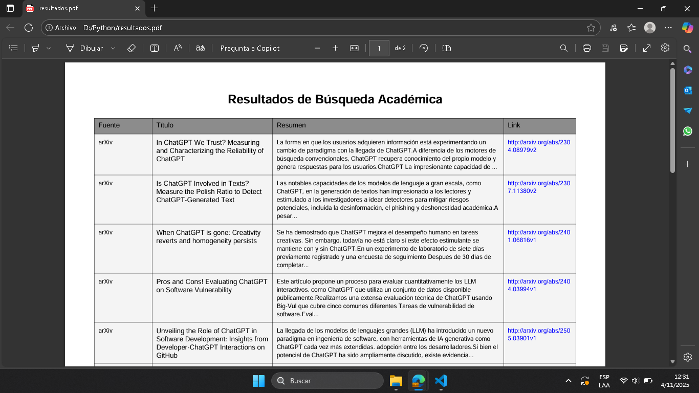

# Proyecto Final CS50 Python – Buscador Multifuente

#### Video de demostración: [Haz clic aquí para ver el video](https://www.youtube.com/watch?v=nN5ij8BHzZo)

#### Descripción:

Este proyecto fue desarrollado como parte de la culminación del curso CS50’s Introduction to Programming with Python, con el objetivo de aplicar de manera práctica los conocimientos adquiridos a lo largo del curso. El sistema implementa un buscador multifuente capaz de realizar consultas en diversas plataformas académicas en línea, integrando los resultados de manera estructurada y accesible para el usuario.

El programa permite realizar búsquedas académicas en múltiples fuentes, procesar la información obtenida, traducirla automáticamente al español cuando sea necesario, y finalmente exportar los resultados en formato PDF para su posterior análisis o presentación. Todo el proceso está diseñado para ser reproducible y eficiente, reduciendo el tiempo necesario para recopilar información relevante de distintas bases de datos.

Su propósito principal es facilitar la recopilación, análisis y presentación de información científica proveniente de APIs públicas, específicamente arXiv, OpenAlex y Crossref. A través de un flujo automatizado, el usuario puede realizar búsquedas temáticas, filtrar resultados relevantes y obtener un documento unificado con los datos procesados. Este proyecto busca servir como una herramienta práctica para estudiantes, investigadores y profesionales que deseen optimizar su proceso de revisión bibliográfica.

## Funcionalidades

- Búsqueda simultánea en diferentes fuentes de información académica.  
- Traducción automática de resúmenes utilizando la biblioteca `googletrans`.  
- Presentación de los resultados en formato tabular mediante `tabulate`.  
- Exportación de los resultados a un archivo PDF utilizando `reportlab`.  

## Ejemplo visual del resultado

El siguiente ejemplo muestra el archivo PDF generado por el programa, con los resultados de la búsqueda académica exportados correctamente.

